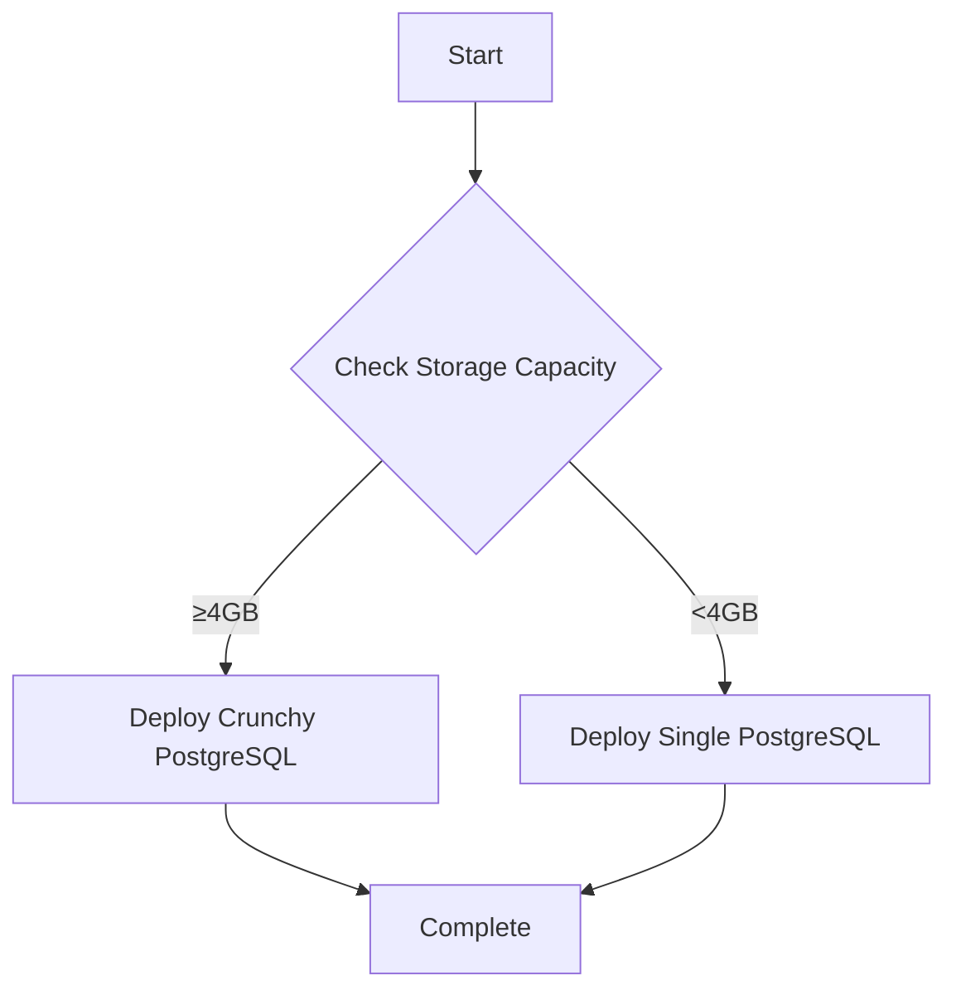

# PostgreSQL Database Deployment Action

Smart PostgreSQL deployment with automatic storage capacity detection.

## Features

- **Automatic Storage Detection**: Checks namespace storage capacity before deployment
- **Smart Database Selection**: Chooses between Crunchy PostgreSQL and single PostgreSQL based on available storage
- **Flexible Configuration**: Supports manual override when needed
- **Backward Compatible**: Works with existing Crunchy configurations

## Usage

### Automatic Selection (Recommended)

```yaml
- name: Deploy PostgreSQL
  uses: bcgov/action-postgres@main
  with:
    oc_namespace: ${{ secrets.OC_NAMESPACE }}
    oc_token: ${{ secrets.OC_TOKEN }}
    values_file: values.yml
    database_type: auto  # Will choose based on storage capacity
```

### Force Specific Database Type

```yaml
- name: Deploy PostgreSQL
  uses: bcgov/action-postgres@main
  with:
    oc_namespace: ${{ secrets.OC_NAMESPACE }}
    oc_token: ${{ secrets.OC_TOKEN }}
    values_file: values.yml
    force_type: crunchy  # Override storage check
```

### Force Single PostgreSQL

```yaml
- name: Deploy PostgreSQL
  uses: bcgov/action-postgres@main
  with:
    oc_namespace: ${{ secrets.OC_NAMESPACE }}
    oc_token: ${{ secrets.OC_TOKEN }}
    values_file: values.yml
    force_type: single  # Use single PostgreSQL regardless
```

## Inputs

| Input | Description | Default |
|-------|-------------|---------|
| `oc_namespace` | OpenShift namespace | Required |
| `oc_token` | OpenShift token | Required |
| `values_file` | Path to values.yml file | Required |
| `database_type` | Database type (crunchy, single, auto) | auto |
| `force_type` | Force specific database type | "" |
| `min_storage_gb` | Minimum storage for Crunchy (GB) | 4 |
| `environment` | Environment name | |
| `triggers` | Paths to trigger deployment | |
| `oc_server` | OpenShift server URL | https://api.silver.devops.gov.bc.ca:6443 |
| `s3_access_key` | S3 access key | |
| `s3_secret_key` | S3 secret key | |
| `s3_bucket` | S3 bucket | |
| `s3_endpoint` | S3 endpoint | |
| `force_cleanup` | Force cleanup | false |
| `release_name` | Release name | |
| `diff_branch` | Branch to diff against | |

## Outputs

| Output | Description |
|--------|-------------|
| `database_type` | The database type that was deployed |
| `release` | Release name |
| `cluster` | Cluster name |

## How It Works

### Storage Capacity Detection

The action automatically checks your OpenShift namespace storage capacity:

1. **Queries Resource Quotas**: Looks for storage quotas in your namespace
2. **Compares Against Threshold**: Checks if you have at least 4GB (configurable)
3. **Recommends Database Type**: 
   - **Crunchy PostgreSQL**: For namespaces with ≥4GB storage
   - **Single PostgreSQL**: For namespaces with <4GB storage

### Database Type Selection

- **`auto`** (default): Automatically chooses based on storage capacity
- **`crunchy`**: Forces Crunchy PostgreSQL deployment
- **`single`**: Forces single PostgreSQL deployment
- **`force_type`**: Overrides automatic selection

### Deployment Flow



## Migration from action-crunchy

If you're currently using `bcgov/action-crunchy`, you can easily migrate:

### Before (action-crunchy)
```yaml
- name: Deploy Crunchy
  uses: bcgov/action-crunchy@main
  with:
    oc_namespace: ${{ secrets.OC_NAMESPACE }}
    oc_token: ${{ secrets.OC_TOKEN }}
    values_file: values.yml
```

### After (action-postgres)
```yaml
- name: Deploy PostgreSQL
  uses: bcgov/action-postgres@main
  with:
    oc_namespace: ${{ secrets.OC_NAMESPACE }}
    oc_token: ${{ secrets.OC_TOKEN }}
    values_file: values.yml
    database_type: auto  # Will automatically choose the best option
```

## Best Practices

1. **Use `auto` mode**: Let the action choose the best database type
2. **Monitor storage usage**: Keep track of your namespace storage
3. **Test both types**: Ensure your application works with both database types
4. **Plan for growth**: Consider storage requirements as your application scales

## Troubleshooting

### Storage Detection Issues

If storage detection isn't working:

1. **Check Resource Quotas**: Ensure your namespace has storage quotas configured
2. **Verify Permissions**: Make sure your OpenShift token has quota read permissions
3. **Manual Override**: Use `force_type` to bypass automatic detection

### Deployment Issues

- **Crunchy Issues**: Check the [action-crunchy documentation](https://github.com/bcgov/action-crunchy)
- **Single PostgreSQL Issues**: Contact the platform team for support

## Contributing

This action is designed to be a smart router between different PostgreSQL deployment strategies. Contributions are welcome!

## License

Apache-2.0
